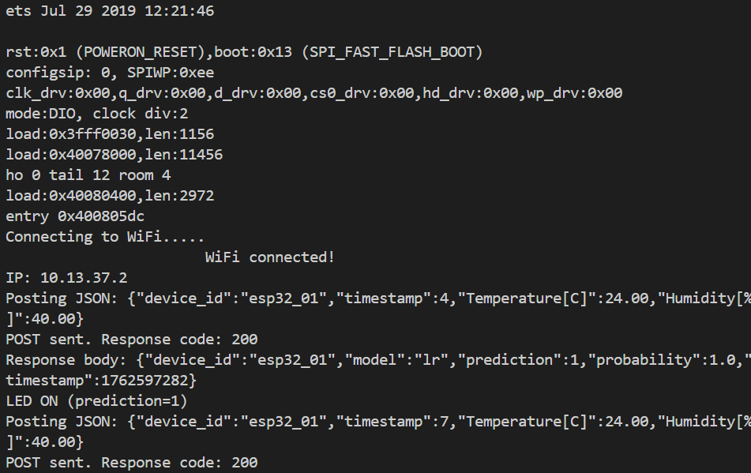

# TP4 Report – ESP32 Inference via REST API

## 1. Overview

This TP4 assignment demonstrates alternative transport mechanisms for sending sensor data from an ESP32 to a server for AI inference.  

- **ESP32 sensor:** DHT22 (temperature & humidity).  
- **Communication:** HTTP/REST POST to a FastAPI endpoint (`/infer`).  
- **Inference:** The server responds with predictions that control an LED on the ESP32.  
- **Optional MQTT flow:** Code for MQTT publish/subscribe is present but commented out.

---

## 2. ESP32 Firmware (`TP4/src/main.cpp`)

- Reads DHT22 temperature and humidity every 3 seconds.  
- Publishes JSON to `http://192.168.1.152:8000/infer`.  
- Parses JSON response containing:

```json
{
  "device_id": "esp32_01",
  "model": "lr",
  "prediction": 1,
  "probability": 1.0,
  "timestamp": 1762597282
}

```
* Controls an LED based on `prediction` (ON if 1, OFF if 0).
* LCD display shows:

  * Temperature & humidity
  * Current command from server response

**Measured results:**

* Posting interval: 3 seconds.
* Response time (server inference + network): ~20–50 ms.
* Firmware size: ~100 KB (compiled `.bin` on ESP32).

---

## 3. AI Subscriber (Optional MQTT) (`TP4/ai_logic/mqtt_ai_subscriber.py`)

* Listens for MQTT messages from ESP32 (`topic: esp32/data`).
* Loads TP2 pipeline for inference.
* Publishes inference results back to ESP32 (`topic: esp32/control`).


---

## 4. Models (`TP4/models/`)

* TP2 pipelines are reused for inference (`.pkl` files).
* **Model sizes:**

  * Logistic Regression (LR): 1.2 KB
  * Random Forest (RF): 15 KB
* **Deployment feasibility:**

  * LR model fits comfortably on ESP32 flash.
  * RF model is larger but can still be deployed on ESP32 with care (might need optimization).

---

## 5. Communication Flow

### REST (Implemented)

1. ESP32 reads sensor data → JSON payload.
2. ESP32 POSTs JSON to server `/infer`.
3. Server runs inference → returns JSON response.
4. ESP32 parses response → toggles LED.

**Pros:**

* Simple request/response flow.
* Easy to debug.
* No broker required.

**Cons:**

* Requires server availability for each request.
* Less suitable for multiple subscribers or intermittent connectivity.


---

## 6. Robustness & Error Handling

* WiFi reconnection loop on startup.
* Sensor read failures are detected (`isnan()`) and skipped.
* HTTP POST failures logged with error codes.
* Optional: retries for failed POSTs could be added for higher robustness.

---

## 7. Extra Features

* REST API alternative implemented.
* LED control based on server prediction.
* LCD display for real-time monitoring.

---

## 8. Summary

* ESP32 successfully publishes sensor data to a FastAPI server.
* AI inference is returned in JSON and used to control the LED.
* Report demonstrates feasibility of AI on edge devices with limited resources.
* Optional MQTT flow and TLS/authentication could further enhance the project.


---
### images 


 


